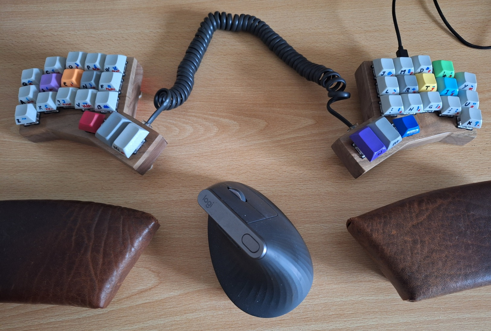

This is the build log of my handwired 3x5+5 keyboard.

## Prototyping

First remove keycaps and adjust the QMK firmware to come close to the target keyboard.

Ergogen resources:

* [ergogen](https://ergogen.cache.works/)
* [Installation](https://docs.ergogen.xyz/usage#cli)
* [FlatFootFox's ergogen tutorial](https://flatfootfox.com/ergogen-introduction/)

Use Inkscape to convert the generated `ergogen/output/outlines/tester.dxf` into an SVG and then a [PDF](ergogen/tester.pdf) to print the test layout.
Use slightly sticky paste to stick the key caps on the paper.

Once satisfied, do the same with the `ergogen/output/outlines/plate.dxf` [PDF](ergogen/plate.pdf) to print the holes to cut in cardboard to fit the key switches for the prototype.
Wire the cardboard keyboard, flash the [firmware](https://github.com/cbosdo/my_qmk/tree/main/keyboards/handwired/minidox) and use for a while to find the issues.
Here I found that I needed splay for the last two columns and a bigger offset to reach the topmost key with the pinky.

## Building the final case

Print the [plates PDF](ergogen/plate.pdf) and glue it on a 5mm thick wood board.
I tried with plywood, but it was too fragile between the keys.
The one I chose in the end is walnut from an old bed.

To cut the holes, the easiest and most precise is:

1. Draw the diagonals of each key as precisely as possible
2. Drill each key on its drawn center using a 13mm bit
3. Square them using a chisel

Once done, cut the plates along the outer lines and sand them.

To build the outer walls of the case I cut bands of 6mm thick and 14mm tall walnut.
Then I carefully cut them to match the edge of the plate.
I cut the holes for the RJ11 connectors, the Pro Micro and the reset switch on the outer walls.
Also cut a grove on the inside to fit an acrylic plate later on.
Now that each piece is ready, glue them to the plate and together,

Draw the shape of the grove on a piece of 2.5mm-thick acrylic and cut along this line.
Better cut a bit further away and shave it afterwards with a chisel to have a tight fit in the grove: there is nothing else to hold it!

Cut two 5mm holes in each acrylic plate for the tenting feet and glue an M5 bolt on the inside.
When dry, you can use M5 crews as feet.

As anti-slippery pads I glued pieces of an old thick non slip table cloth on the acrylic and the screws head.

## Wiring

First solder the diodes together and then the columns.
Otherwise the insulation of the columns wires could melt where the touch the diode wires.

Place the Arduino Pro Micro and the switch in their slots.
Cut the Dupond wires at the exact length to avoid a wiring mess after.
Solder the rest.

## Enjoy

Flash the Arduino Pro Micros with the [firmware](https://github.com/cbosdo/my_qmk/tree/main/keyboards/handwired/minidox) if not reusing the ones from the prototype.

